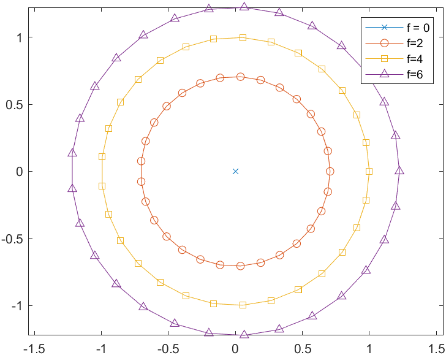

## Linear Algebra HW14

### 1

$$
\begin{flalign}
&Z = A+K\\
&\ \ \ =\frac{Z+Z^H}{2}+K\Rightarrow K = \frac{Z-Z^H}{2}-<ans>\\
&Z = \begin{bmatrix}
3&2\\4&4
\end{bmatrix} = \begin{bmatrix}
3&3\\3&4
\end{bmatrix}+\begin{bmatrix}
0&-1\\1&0
\end{bmatrix}-<ans>\\
&Z = \begin{bmatrix}
3+i&4+2i\\0&5
\end{bmatrix} = \begin{bmatrix}
3+i&2+i\\2-i&5
\end{bmatrix}+\begin{bmatrix}
0&2+i\\-2+i&0
\end{bmatrix}-<ans>\\
&Z = \begin{bmatrix}
i&i\\-i&i
\end{bmatrix} = \begin{bmatrix}
i&i\\-i&i
\end{bmatrix}+\begin{bmatrix}
0&0\\0&0
\end{bmatrix}-<ans>
&
\end{flalign}
$$

### 2

$$
\begin{flalign}
&A = \begin{bmatrix}
5&-3\\4&-2
\end{bmatrix},\ \lambda = 2,1\\
&for\ \ \lambda=2,\ (A-\lambda I)x_1=0\Rightarrow x_1 = (1,1)^T\\
&for\ \ \lambda=1,\ (A-\lambda I)x_2=0\Rightarrow x_2 = (1,-1)^T\\
&Let\ \ U=[x_1\ \ x_2],\ \ U^{-1}AU = \begin{bmatrix}
2&7\\0&1
\end{bmatrix}-<ans>\\
&B = \begin{bmatrix}
0&1&0\\0&0&0\\1&0&0
\end{bmatrix},\ \lambda = 0,0,0\\
&for\ \ \lambda=0,\ (B-\lambda I)x_1=0\Rightarrow x_1 = (0,0,1)^T\\
&Select\ \ x_2 = (0,1,0)^T\ \ and\ \ x_3=(1,0,0)^T,\ and\ \ Let\ \ U_1 = [x_1\ x_2\ x_3]\\
&U_1^{-1}BU = \begin{bmatrix}
0&0&1\\0&0&0\\0&1&0
\end{bmatrix}\\
&Select\ \ two\ \ perpendicular\ \ vectors(0,1)^T,(1,0)^T\\
&U_2=\begin{bmatrix}
1&0&0\\0&0&1\\0&1&0
\end{bmatrix},\  U_2^{-1}(U_1^{-1}BU_1)U_2 = \begin{bmatrix}
0&1&0\\0&0&1\\0&0&0
\end{bmatrix}=U^{-1}BU\\ 
&U = U_1U2 = \begin{bmatrix}
0&1&0\\0&0&1\\1&0&0
\end{bmatrix}-<ans>
&
\end{flalign}
$$

### 3

$$
\begin{flalign}
&Let\ \ A\in\R^{n\times n} \ \ be\ \ upper\ \ triangular\ \ matrix.\ \ a_{ij} = 0\ \ \forall i>j\\
&If\ \ A\ \ is\ \ a\ \ normal\ \ matrix,\ \ then\ \ A^HA = AA^H\\
&\Rightarrow (A^HA)\ \ is \ \ a\ \ Hermitian\ \ matrix.\\
&(A^HA)_{ii} = (AA^H)_{ii}\Rightarrow\sum_{m=i}^{m=n} a_{im}\bar a_{im} = \sum_{m=1}^{m=i} a_{mi}\bar a_{mi}\\
&\Rightarrow a_{ij}=0\ \forall i\neq j\\
&\Rightarrow A\ \ is\ \ a\ \ diagonal\ \ matrix.
&
\end{flalign}
$$

### 4

$$
\begin{flalign}
&If\ \ P\ \ is\ \ permutation\ \ matrix,\ then\ \ P^{-1} = P^H\\
&PP^H = PP^{-1} = I = P^{-1}P = P^HP\\
&\Rightarrow P\ \ is\ \ a\ \ normal\ \ matrix.
&
\end{flalign}
$$

### 5

$$
\begin{flalign}
&(i)\\
&A = \begin{bmatrix}
5&4\\4&5
\end{bmatrix} = \begin{bmatrix}
1&0\\\frac{4}{5}&1
\end{bmatrix}\begin{bmatrix}
5&0\\0&\frac{9}{5}
\end{bmatrix}\begin{bmatrix}
1&\frac{4}{5}\\0&1
\end{bmatrix}\\
&\begin{bmatrix}
x&y
\end{bmatrix}A\begin{bmatrix}
x\\y
\end{bmatrix} = \begin{bmatrix}
x&y
\end{bmatrix}LDU\begin{bmatrix}
x\\y
\end{bmatrix} = 5(x+\frac{4}{5})^2+\frac{9}{5}y^2-<ans>\\
&(ii)\\
&from\ \ det(A-\lambda I)=0\Rightarrow \lambda = 1,\ 9\\
&for\ \ \lambda =1,\ (A-\lambda I)x_1=0\Rightarrow x_1 = c_1(1,-1)^T\\
&for\ \ \lambda =9,\ (A-\lambda I)x_2=0\Rightarrow x_2 = c_2(1,1)^T\\
&Set\ \ c_1=c_2=\frac{1}{\sqrt{2}},\ \ and\ \ Q = [x_1\ \ x_2],\ \ then\ \ A = Q\Lambda Q^T\\
&\begin{bmatrix}
x&y
\end{bmatrix}Q\Lambda Q^T\begin{bmatrix}
x\\x
\end{bmatrix} = 
(\frac{1}{\sqrt{2}})^2\begin{bmatrix}
x-y&x+y
\end{bmatrix}\begin{bmatrix}
1&0\\0&9
\end{bmatrix}
\begin{bmatrix}
x-y\\x+y
\end{bmatrix} \\
&\ \ \ \ \ \ \ \ \ \ \ \ \ \ \ \ \ \ \ \ \ \ \ \ \ \ \ \ \;= \frac{1}{2}(x-y)^2+\frac{9}{2}(x+y)^2-<ans>\\
&(iii)\\
&(i)a>0,\ ac-b^2>0\Rightarrow positive\ \ definite\\
&(ii)\lambda(A) = 1,9>0\Rightarrow positive\ \ definite-<ans>
&
\end{flalign}
$$

### 6

$$
\begin{flalign}
&If\ \ the\ \ columns\ \ of\ \  R\ \  are\ \ linearly\ \ dependent,\ \ then\ \ ||Rx||\ge 0.\\
&\because R\ \ has\ \ null\ \ space.\\
&\Rightarrow X^TR^TRX\ge 0,\ \ R^TR\ \ is\ \ positive\ \ semidefinite.-<ans>\\
&If\ \ the\ \ columns\ \ of\ \  R\ \  are\ \ linearly\ \ independent,\ \ then\ \ ||Rx||\gt 0.\\
&\Rightarrow X^TR^TRX\gt 0,\ \ R^TR\ \ is\ \ positive\ \ definite.-<ans>
&
\end{flalign}
$$

### 7

$$
\begin{flalign}
&R = \sqrt{D}L^T,\ \ then\ \ R^TR = L\sqrt{D}^T\sqrt{D}L^T = LDU = A\\
&A = \begin{bmatrix}
1&0\\\frac{4}{5}&1
\end{bmatrix}\begin{bmatrix}
5&0\\0&\frac{9}{5}
\end{bmatrix}\begin{bmatrix}
1&\frac{4}{5}\\0&1
\end{bmatrix}\\
&R = \sqrt{D}L^T = \begin{bmatrix}
\sqrt{5}&0\\0&\sqrt{\frac{9}{5}}
\end{bmatrix}\begin{bmatrix}
1&\frac{4}{5}\\0&1
\end{bmatrix} = 
\begin{bmatrix}
\sqrt{5}&\frac{4}{\sqrt{5}}\\0&\frac{3}{\sqrt{5}}
\end{bmatrix}-<ans>\\
&R = \sqrt{\Lambda}Q^T,\ \ then\ \ R^TR = Q\sqrt{\Lambda}^T\sqrt{\Lambda}Q^T = Q\Lambda Q^T = A\\
&R = \sqrt{\Lambda}Q^T = \begin{bmatrix}
1&0\\0&\sqrt{9}
\end{bmatrix}\begin{bmatrix}
\frac{1}{\sqrt{2}}&\frac{-1}{\sqrt{2}}\\
\frac{1}{\sqrt{2}}&\frac{1}{\sqrt{2}}
\end{bmatrix} = \begin{bmatrix}
\frac{1}{\sqrt{2}}&\frac{-1}{\sqrt{2}}\\
\frac{3}{\sqrt{2}}&\frac{3}{\sqrt{2}}
\end{bmatrix} -<ans>\\
&R = Q\sqrt{\Lambda}Q^T,\ \ then\ \ R^TR = Q\sqrt{\Lambda}^TQ^TQ\sqrt{\Lambda}Q^T = Q\Lambda Q^T\\
&R = Q\sqrt{\Lambda}Q^T =\begin{bmatrix}
\frac{1}{\sqrt{2}}&\frac{1}{\sqrt{2}}\\
\frac{-1}{\sqrt{2}}&\frac{1}{\sqrt{2}}
\end{bmatrix} \begin{bmatrix}
1&0\\0&\sqrt{9}
\end{bmatrix}\begin{bmatrix}
\frac{1}{\sqrt{2}}&\frac{-1}{\sqrt{2}}\\
\frac{1}{\sqrt{2}}&\frac{1}{\sqrt{2}}
\end{bmatrix} =
\begin{bmatrix}
2&1\\1&2
\end{bmatrix}-<ans>
&
\end{flalign}
$$

### 8

$$
\begin{flalign}
&\because A\ \ is\ \ positive\ \ definite.\Rightarrow A = LDU = LDL^T\\
&Let\ \  C = L\sqrt{D}\Rightarrow CC^T = LDL^T=A\\
&X^TAX = X^TCC^TX\gt 0\\
&Hence,\ \ C = L\sqrt{D}\ \ with\ \  positive\ \  diagonal \ \ elements.
&
\end{flalign}
$$

### 9

$$
\begin{flalign}
&(i)\\
&\frac{\partial^2F}{\partial x^2}|_{x = y=0} = 4e^x|_{x=y=0} = 4\\
&\frac{\partial^2F}{\partial y^2}|_{x = y=0} = 5xsiny+12|_{x=y=0} = 12\\
&\frac{\partial^2F}{\partial x\partial y}|_{x = y=0}=-5cosy|_{x=y=0} = -5\\
&\Rightarrow \frac{\partial^2F}{\partial x^2}|_{x = y=0}\frac{\partial^2F}{\partial y^2}|_{x = y=0} = 48\gt(\frac{\partial^2F}{\partial x\partial y}|_{x = y=0})^2 = 25\\
&\Rightarrow F\ \ is\ \ positive\ \ definite,\ \ and\ \ (0,0)\ \ is\ \ minimum\ \ point.-<ans>\\
&(ii)\\
&\frac{\partial^2F}{\partial x^2}|_{x =1,y=\pi } = 2cosy|_{x =1, y=\pi } = -2\\
&\frac{\partial^2F}{\partial y^2}|_{x = ,y=0} = -(x^2-2x)cosy|_{x =1 ,y=\pi } = -1\\
&\frac{\partial^2F}{\partial x\partial y}|_{x =1 ,y=\pi }=-(2x-2)siny|_{x =1 ,y=\pi } = 0\\
&\Rightarrow \frac{\partial^2F}{\partial x^2}|_{x =1 ,y=\pi }\frac{\partial^2F}{\partial y^2}|_{x =1 ,y=\pi } = 2\gt(\frac{\partial^2F}{\partial x\partial y}|_{x =1 ,y=\pi })^2 = 0\\
&\Rightarrow F\ \ is\ \ negative\ \ definite,\ \ and\ \ (1,\pi)\ \ is\ \ maximum\ \ point.-<ans>
&
\end{flalign}
$$

### 10

$$
\begin{flalign}
&(i)\because All\ \ eigenvalues\ \ of\ \ positive\ \ definite\ \ matrix\ \ are\ \ positive.\\
&(ii)\because All\ \ projection\ \ matrix\ \ are\ \ singular\ \ expect \ \ identity\ \ matrix\ I.\\
&(iii)\because The\ \ eigenvalues\ \ of\ \ a\ \ diagonal\ \ matrix\ \ are\ \ diagonal\ \ entries.
\end{flalign}
$$

### 11

> $\lambda =4$

> $\lambda =2$

> $\lambda =1$

> $\lambda =0$

> $\lambda =-1$

> $\lambda =-2$

> $\lambda =-4$

