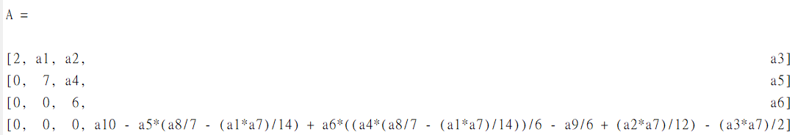

## Linear Algebra HW2

### 1

**first three pivot are 2,7,6. 因為在做高斯消去時並不會影響到原來這3個pivots**

```matlab
syms a1 a2 a3 a4 a5 a6 a7 a8 a9 a10

A = [2  a1 a2 a3;...
     0  7  a4 a5;...
     0  0  6  a6;...
     a7 a8 a9 a10];
 
[n,~] = size(A);

for i=1:n-1
    m = A(i+1:n,i)/A(i,i);
    A(i+1:n,:) = A(i+1:n,:) - m*A(i,:);
end
```

after calculation



**只要A矩陣經計算後(如上圖)，右下角為9就可以確定第4個pivot為9**


### 2

(a) **True**, Each column of AB is the product of A and a column of B 

(b) **False**, Each column of AB is a combination of the columns of A, 所以還是要看A的係數

(c) **False**, $(AB)^2 = ABAB$

(d) **True**, if A is a lower triangle matrix, then $A_{ij} = 0$ $\forall i<j$. By the matrix operation, if both A and B are lower triangle matrices, then             

​     $(AB)_{ij} = 0$ $\forall i<j$ , hence $AB$ is a lower triangle matrix.

### 3

**For $A_1$** , 會將B的第一列乘4，第二列乘3，第三列乘2，第四列乘1，再將第一列到第四列顛倒。
$$
(A_1)^{-1} = 
\begin{bmatrix}
0&0&0&\frac{1}{4}\\
0&0&\frac{1}{3}&0\\
0&\frac{1}{4}&0&0\\
1&0&0&0
\end{bmatrix}
$$
**For $A_2$**, 會將B的第一列乘$-\frac{1}{2}$加到第二列，乘4加到第四列，將第二列乘$-\frac{2}{3}$加到第三列，將第三列乘$-\frac{3}{4}$加到第四列
$$
(A_2)^{-1} = 
\begin{bmatrix}
1&0&0&0\\
\frac{1}{2}&1&0&0\\
\frac{1}{3}&\frac{2}{3}&0&0\\
-\frac{15}{4}&\frac{1}{2}&\frac{3}{4}&1
\end{bmatrix}
$$

### 4

以下是用高斯消去法的步驟
$$
A = 
\begin{bmatrix}
0&1&1\\
1&0&1\\
2&3&4
\end{bmatrix}
\Rightarrow
\begin{bmatrix}
1&0&1\\
0&1&1\\
2&3&4
\end{bmatrix},
P_1 = 
\begin{bmatrix}
0&1&0\\
1&0&0\\
0&0&1
\end{bmatrix}\\
A' = 
\begin{bmatrix}
1&0&1\\
0&1&1\\
2&3&4
\end{bmatrix}
\Rightarrow
\begin{bmatrix}
1&0&1\\
0&1&1\\
0&3&2
\end{bmatrix},
L_1 = 
\begin{bmatrix}
1&0&0\\
0&1&0\\
-2&0&1
\end{bmatrix}\\
A' = 
\begin{bmatrix}
1&0&1\\
0&1&1\\
0&3&2
\end{bmatrix}
\Rightarrow
\begin{bmatrix}
1&0&1\\
0&1&1\\
0&0&-1
\end{bmatrix},
L_2 = 
\begin{bmatrix}
1&0&0\\
0&1&0\\
0&{-3}&1
\end{bmatrix}\\
$$
(a) L和U分別為
$$
L = (L_2*L_1)^{-1}\\
L = 
\begin{bmatrix}
1&0&0\\
0&1&0\\
2&3&1
\end{bmatrix}
\\
U =
\begin{bmatrix}
1&0&1\\
0&1&1\\
0&0&-1
\end{bmatrix}
$$
(b) 
$$
L^{-1} = L_2L_1 = 
\begin{bmatrix}
1&0&0\\
0&1&0\\
-2&-3&1
\end{bmatrix}
$$

### 5

(1) 
$$
A =& 

\begin{bmatrix}
1&0&0\\
2&1&0\\
1&4&1
\end{bmatrix}

\begin{bmatrix}
5&7&8\\
0&2&3\\
0&0&6
\end{bmatrix}\\
=& 
\begin{bmatrix}
1&0&0\\
0&1&0\\
1&0&1
\end{bmatrix}
\begin{bmatrix}
1&0&0\\
2&1&0\\
0&4&1
\end{bmatrix}
\begin{bmatrix}
5&7&8\\
0&2&3\\
0&0&6
\end{bmatrix}\\ 
=&L*U
$$
**將第2列乘4加到第3列，將第一列乘2加到第二列，乘1加到第三列**

(2) **no row exchange required**

(3)
$$
Lc = b\Rightarrow
\begin{bmatrix}
1&0&0\\
2&1&0\\
1&4&1
\end{bmatrix}
\begin{bmatrix}
c_1\\
c_2\\
c_3
\end{bmatrix}=
\begin{bmatrix}
1\\
2\\
3
\end{bmatrix}\\
c_1 = 1,c_2 = 0,c_3 = 2\\
Ux = c\Rightarrow
\begin{bmatrix}
5&7&8\\
0&2&3\\
0&0&6
\end{bmatrix}
\begin{bmatrix}
x_1\\
x_2\\
x_3
\end{bmatrix}=
\begin{bmatrix}
1\\
0\\
2
\end{bmatrix}\\
ANS:x = 
\begin{bmatrix}
1/30\\
-1/2\\
11/30
\end{bmatrix}\\
$$


### 6

$$
P = 
\begin{bmatrix}
0&1&0\\
1&0&0\\
0&0&1
\end{bmatrix}\\
PA = 
\begin{bmatrix}
1&0&1\\
0&1&1\\
2&3&4
\end{bmatrix}\\
from\quad the\quad result \quad in\quad(4)\\
LDU = 
\begin{bmatrix}
1&0&0\\
0&1&0\\
2&3&1
\end{bmatrix}
\begin{bmatrix}
1&0&0\\
0&1&0\\
0&0&-1
\end{bmatrix}\
\begin{bmatrix}
1&0&1\\
0&1&1\\
0&0&1
\end{bmatrix}\\
$$

### 7

(1)Gaussian elimination and back substitution

left side: $(n^2+...+1^2)-(n+..+1) = \frac{n(n+1)(2n+1)}{6} = \frac{n^3-n}{3}$

right side : $(1+2+...+n)+[(n-1)+(n-2)+...1] \approx n^2$

back substitution $\approx\frac{n^2}{2}$

total$\approx \frac{2n^3+3n^2}{6}$

(2)Gauss-Jordan Method (algorithm)

Reference  : [gauss-complexity.pdf (ryerson.ca)](https://math.ryerson.ca/~danziger/professor/MTH108/Handouts/gauss-complexity.pdf)

For Each row i ($R_i$) from 1 to n

​		If any row  j below row i has non zero entries to the right of the first non zero entry in row i

​				$R_i\leftrightarrow R_j$

​		$R_i\rightarrow\frac{1}{c}R_j$ where c = the first non-zero entry of row i

​		For each row j < i

​				$R_i\leftrightarrow R_j-dR_i$ where d = the entry in row j which is directly below the pivot in row i

​		If any 0 rows have appeared exchange them to the bottom if the matrix.

next i

 For each non zero row i ($R_i$) from n to 1

​		For each j < i

​				$R_i\leftrightarrow R_j-dR_i$ where b = the value in row j directly above the pivot in row i.

the complexity is : 
$$
\begin{aligned}
&\sum_{i = 1}^{n}[(n+1)+(n-i)(n+1)]+\sum_{i = 1}^{n}[(n-i)(n+1)]
\\&=\sum_{i = 1}^{n}\sum_{i = 1}^{n}(2n-2i+1)(n+1)
\\&= \sum_{i = 1}^{n}2n^2+3n^2+1-2(n+1)i\\
& = 2n^3+3n^2+n+n(n+1)^2\\
&= 3n^3+5n^2+2n
\end{aligned}
$$

#### 結論

兩者比較起來Gaussian elimination and back substitution會比Gauss-Jordan Method好一些，但資料量很大時複雜度都是$O(n^3)$

### 8

$P^3 = I$

將identity matrix做兩次permutation
$$
P = 
\begin{bmatrix}
0&0&1\\
1&0&0\\
0&1&0
\end{bmatrix}
$$
$P^4\neq I$

將identity matrix做三次permutation
$$
P = 
\begin{bmatrix}
0&0&1&0\\
1&0&0&0\\
0&1&0&0\\
0&0&0&1
\end{bmatrix}
$$


### 9

$$
PA=LDU\\
(PA)^{-1} = (LDU)^{-1}\\
A^{-1}P^{-1} = U^{-1}D^{-1}L^{-1}\\
A^{-1} = U^{-1}D^{-1}L^{-1}P
$$

