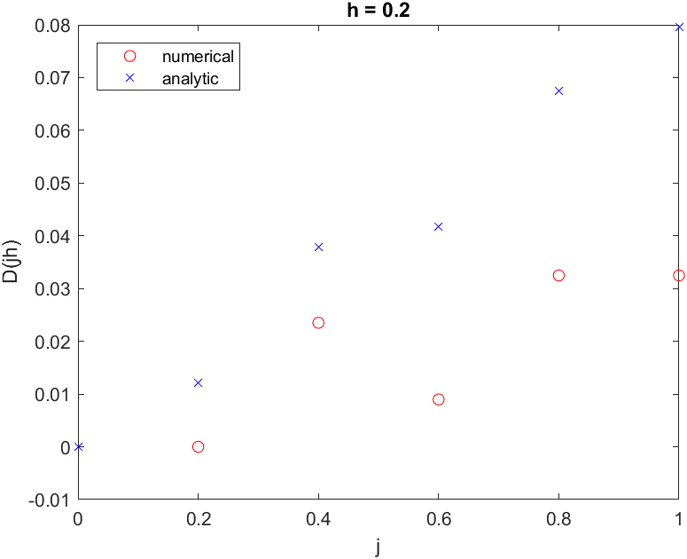
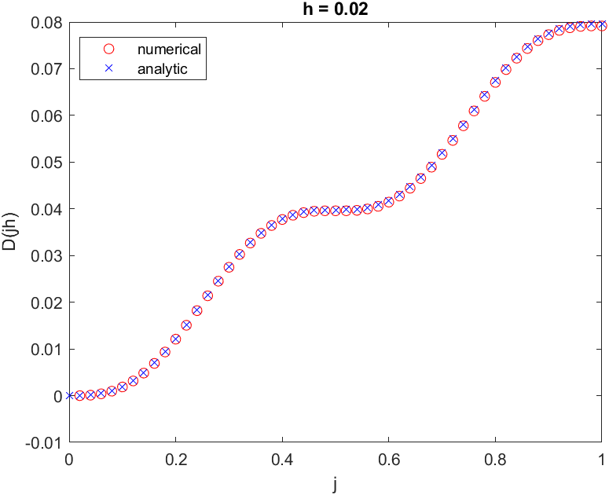

## Linear Algebra HW3

### 1

#### (a)

​			 $A = LDU$

​			 $A^T =U^TD^TL^T$

​			 $D\quad and\quad D^T\quad have\quad same\quad pivots. -<ans>$

#### (b)

​			 $A\quad is\quad symmetric\rightarrow A^T = A$

​			 ${(AA^{-1})}^T = {(A^{-1})}^TA^T = I$

​			 $\Rightarrow {(A^{-1})}^T = {(A^{T})}^{-1} = A^{-1}-<ans>$

#### (c)

​			 $\because A\quad is\quad symmetric\rightarrow A = A^T$

​			 $(R^TAR)^T = R^TA^TR = R^TAR$

​			 $\Rightarrow R^TAR\quad is \quad symmetric.-<ans>$

​			 $dim((R^T)_{nm}A_{mm}R_{mn}) = n*n-<ans>$

### 2

#### (a) True

​             $for\quad any\quad triangular\quad matrix\quad A,\quad A \quad can\quad be\quad factorized $

​			 $ by\quad LD\quad or\quad DU.$

​			 $where\quad L = L_1L_2...L_n,\quad U = U_1U_2...U_n\quad can\quad be\quad solved$

​			 $by\quad Gauss\quad Elimination.$

​			 $inverse\quad of\quad L_1,...,L_n,U_1,...,U_n\quad are\quad also\quad triangular\quad matrices$

​			 $Hence,A^{-1} = D^{-1}L^{-1} \quad or\quad D^{-1}L^{-1}\quad is \quad also\quad a$

​			 $triangular\quad matrix.-<ans>$

#### (b) True

​			 $From\quad the\quad result\quad in\quad 1(b),\quad we\quad can\quad get$

​			 $(A^{-1})^T=A^{-1}-<ans>$

#### (c) False

​			 $proof\quad by\quad contradiction:$
$$
A = 
\begin{bmatrix}
1&2&0\\
3&4&5\\
0&6&7
\end{bmatrix}
,\quad A^{-1} = 
\begin{bmatrix}
\frac{1}{22}&\frac{7}{22}&\frac{-5}{22}\\
\frac{21}{44}&\frac{-7}{44}&\frac{5}{44}\\
\frac{-9}{22}&\frac{3}{22}&\frac{1}{22}
\end{bmatrix}
$$

#### (d) False

​			 $When\quad calculating\quad A^{-1}\quad by\quad Gauss-Jordan\quad method,\quad all\quad \\entries\quad might\quad not \quad be\quad whole\quad numbers\quad after\quad calculation.$

#### (e) True

​			 $\because fractions\in\Q, \quad and\quad \Q\quad is\quad a \quad field.$

​			 $\therefore fractions\quad have\quad closure\quad with\quad operations(+,-,*,/).$

### 3

​			 $D_{j+1}-2D_j+D_{j-1} = h^2f(jh)\quad j = 1,...,5$
$$
\begin{bmatrix}
1&-2&1&0&0&0&0\\
0&1&-2&1&0&0&0\\
0&0&1&-2&1&0&0\\
0&0&0&1&-2&1&0\\
0&0&0&0&1&-2&1\\
\end{bmatrix}
\begin{bmatrix}
D_0\\
D_1\\
D_2\\
D_3\\
D_4\\
D_5\\
D_6
\end{bmatrix} = 
\begin{bmatrix}
h^2f(h)\\
h^2f(2h)\\
h^2f(3h)\\
h^2f(4h)\\
h^2f(5h)
\end{bmatrix}
$$
​			 $because\quad of\quad initail\quad conditions,D_0 = D_1 = 0, \quad the\quad equations\quad can\quad be\quad reduced\quad to:$
$$
\begin{bmatrix}
1&0&0&0&0\\
-2&1&0&0&0\\
1&-2&1&0&0\\
0&1&-2&1&0\\
0&0&1&-2&1\\
\end{bmatrix}
\begin{bmatrix}
D_2\\
D_3\\
D_4\\
D_5\\
D_6
\end{bmatrix} = 
\begin{bmatrix}
h^2f(h)\\
h^2f(2h)\\
h^2f(3h)\\
h^2f(4h)\\
h^2f(5h)
\end{bmatrix}
$$
​			 $Since\quad final\quad speed\quad equals\quad to\quad 0,\quad D_5 = D_6.$

​			 $the\quad equation\quad can\quad be\quad represented\quad as\quad below:$
$$
\begin{bmatrix}
-2&1&0&0&0\\
1&-2&1&0&0\\
0&1&-2&1&0\\0
&0&1&-2&1\\0
&0&0&1&-1\\
\end{bmatrix}
\begin{bmatrix}
D_1\\
D_2\\
D_3\\
D_4\\
D_5
\end{bmatrix} = 
\begin{bmatrix}
h^2f(h)\\
h^2f(2h)\\
h^2f(3h)\\
h^2f(4h)\\
h^2f(5h)
\end{bmatrix}
$$
​			$Let\quad h=0.2$
$$
\begin{bmatrix}
D_1\\
D_2\\
D_3\\
D_4\\
D_5
\end{bmatrix}=
\begin{bmatrix}
0\\
0.0235\\
0.090\\
0.0325\\
0.0325
\end{bmatrix}-<ans>
$$
​			 $the\quad plot\quad D(jh)\quad vs.\quad j:$

 
 
 

### 4

​			 $without\quad patial\quad pivoting:$
$$
A = 
\begin{bmatrix}
.0001&0\\
1&10000
\end{bmatrix}=
\begin{bmatrix}
1&0\\
10000&1
\end{bmatrix}
\begin{bmatrix}
.0001&0\\
0&10000
\end{bmatrix}
\begin{bmatrix}
1&0\\
0&1
\end{bmatrix}
$$
​			 $with\quad partial\quad pivoting:$
$$
A' = 
\begin{bmatrix}
1&10000\\
.0001&0
\end{bmatrix}=
\begin{bmatrix}
1&0\\
.0001&1
\end{bmatrix}
\begin{bmatrix}
1&0\\
0&-1
\end{bmatrix}
\begin{bmatrix}
1&10000\\
0&1
\end{bmatrix}
$$
​			 $after\quad scaling\quad by\quad multiply\quad 10000$

​			 $without\quad patial\quad pivoting:$​
$$
A = 
\begin{bmatrix}
1&0\\
10000&10^8
\end{bmatrix}=
\begin{bmatrix}
1&0\\
10000&1
\end{bmatrix}
\begin{bmatrix}
1&0\\
0&10^8
\end{bmatrix}
\begin{bmatrix}
1&0\\
0&1
\end{bmatrix}
$$
​			 $with\quad patial\quad pivoting:$​
$$
A = 
\begin{bmatrix}
10000&10^8\\
1&0
\end{bmatrix}=
\begin{bmatrix}
1&0\\
.0001&1
\end{bmatrix}
\begin{bmatrix}
1&0\\
0&-10000
\end{bmatrix}
\begin{bmatrix}
1&10^8\\
0&1
\end{bmatrix}
$$
​			 $after\quad pivoting,\quad we\quad can\quad get\quad more\quad stable\quad pivots.$

​			 $after\quad scaling,\quad we\quad can\quad avoid\quad gettig\quad small\quad pivots.$

### 5

#### (a) True

​			 $b_1 = 0,\quad \vec B = (0,b_2,b_3),\quad where\quad b_2,b_3\in\R$

​			 $For\quad any\quad two\quad vectors\quad\vec B_1,\vec B_2\quad in\quad \vec B,\quad\vec B_1+\vec B_2\quad is \quad still\quad in\quad \vec B.$

​			 $\forall c\in\R,\quad and\quad\forall\vec B_1\in\vec B,\quad c\vec B_1\in\vec B$

#### (b) False

​			 $\because for \quad scaling,\quad b_1\quad might\quad not \quad be\quad 1,\quad as\quad well\quad as\quad scaling. $

#### (c) False

​			 $Proof\quad by\quad contradiction,$

​			 $let\quad \vec b_1 = (0,0,1),\vec b_2 = (0,1,0),\vec b_1+\vec b_2 = (0,1,1)$

#### (d) True

​			$All\quad combinations\quad means\quad that\quad for\quad addition\quad and\quad scaling\quad still \quad in$

​			$the\quad span\quad of\quad given\quad vectors.$

#### (e) True

​			 $For\quad addition \quad of\quad any\quad two\quad vectors\quad which \quad are \quad lying\quad in\quad plane $

​			 $is\quad still\quad lying\quad in\quad plane,as\quad well\quad as\quad scaling.$

### 6

#### (f) False

​			 $Proof\quad by\quad contradictions:$
$$
Let\quad A = 
\begin{bmatrix}
1&0\\
0&1\\
0&0
\end{bmatrix},
b_1 = 
\begin{bmatrix}
1\\
0\\
-1
\end{bmatrix},
b_2 = 
\begin{bmatrix}
0\\
1\\
1
\end{bmatrix}\\
b_1+b_2 = 
\begin{bmatrix}
1\\
1\\
0
\end{bmatrix},in\quad the \quad column\quad space\quad of \quad A.
$$

#### (g) True

​			 $\because the\quad column\quad space\quad of \quad A\quad contains\quad only\quad zero\quad vector,$

​			 $\therefore All\quad entries\quad of \quad A \quad is \quad 0.$

#### (h) True

​			 $Scaling\quad would\quad not\quad change\quad column\quad space.$

#### (i) False

​			 $Proof\quad by\quad contradiction:$
$$
A = 
\begin{bmatrix}
1&0\\
0&1
\end{bmatrix},\quad
A-I = 
\begin{bmatrix}
0&0\\
0&0
\end{bmatrix}
$$

#### (j) True

​			 $\because Dimension\quad of\quad\R^2\quad and\quad \R^3\quad is\quad different.$

​			 $Although\quad \R^2\quad is\quad isomorphic\quad to\quad the\quad subset (a,b,0) \quad of\quad R^3,$

​			 $but\quad it's\quad also\quad isomorphic\quad to\quad infinitely\quad many\quad other\quad subspaces$

​			 $of\quad \R^3.$

### 7

#### (a)

$$
\begin{aligned}[]
[A\quad B] &= 
\begin{bmatrix}
1&2&0&3&b_1\\
4&5&1&8&b_2\\
2&1&1&2&b_3
\end{bmatrix}\\&=
\begin{bmatrix}
1&2&0&3&b_1\\
0&-3&1&-4&b_2-4b_1\\
0&-3&1&-4&b_3-2b_1
\end{bmatrix}\\&=
\begin{bmatrix}
1&2&0&3&b_1\\
0&-3&1&-4&b_2-4b_1\\
0&0&0&0&2b_1-b_2+b_3
\end{bmatrix}
\end{aligned}
$$

#### (b)

​			 $b\quad have\quad to \quad lie\quad in\quad the\quad column\quad space\quad of\quad A.$

​			 $That\quad is,\quad 2b_1-b_2+b_3 = 0-<ans>$

#### (c)

$$
U =
\begin{bmatrix}
1&2&0&3\\
0&-3&1&-4\\
0&0&0&0
\end{bmatrix}=
\begin{bmatrix}
1&2&0&3\\
0&1&\frac{-1}{3}&\frac{4}{3}\\
0&0&0&0
\end{bmatrix}\\
Null\quad space\quad can\quad be\quad ontained\quad from\quad solving\quad Ux = 0\\
Null\quad space\quad of\quad U \quad is:
\begin{bmatrix}
1\\1\\-1\\-1\\
\end{bmatrix},
\begin{bmatrix}
0\\3\\-1\\-2
\end{bmatrix}-<ans>
$$

​			