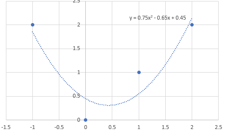
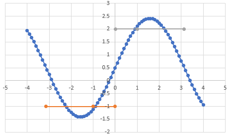
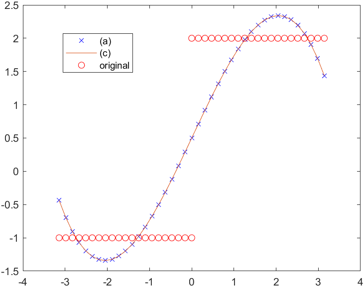

## Linear Algebra HW9

### 1

$$
\begin{flalign}
&||Q_1Q_2x|| = (Q_1Q_2x)^T(Q_1Q_2x) = x^TQ_2^TQ_1^TQ_1Q_2x = x^TIx\\
&\Rightarrow (Q_1Q_2)^T(Q_1Q_2) = I\\
&\Rightarrow Q_1Q_2\quad is\quad a\quad othogonal\quad matrix.
&
\end{flalign}
$$

### 2

$$
\begin{flalign}
&q_1 = a/||a|| = (0.7071,0.7071,0)^T-<ans>\\
&b' = b-(q_1^Tb)q_1\\
&q_2 = b'/||b'|| = = (0.4082,-0.4082,0.8165)^T-<ans>\\
&c' = c-(q_1^Tc)q_1-(q_2^Tc)q_2\\
&q_3 = c'/||c'|| = (-0.5774,0.5774,0.5774)^T-<ans>
&
\end{flalign}
$$

### 3

#### (a)

$$
\begin{flalign}
&A^TA\hat x = A^Tb\Rightarrow
\begin{bmatrix}
1&-1&1\\1&0&0\\1&1&1\\1&2&4
\end{bmatrix}
\begin{bmatrix}
\hat C\\\hat D\\\hat E
\end{bmatrix} = 
\begin{bmatrix}
2\\0\\1\\2
\end{bmatrix}\\
&\begin{bmatrix}
\hat C\\\hat D\\\hat E
\end{bmatrix} =
\begin{bmatrix}
0.45\\-0.65\\0.75
\end{bmatrix}-<ans>
&
\end{flalign}
$$

#### (b)

$$
\begin{flalign}
&q_1 = a/||a||\\
&b' = b-(q_1^Tb)q_1\\
&q_2 = b'/||b'||\\
&c' = c-(q_1^Tc)q_1-(q_2^Tc)q_2\\
&q_3 = c'/||c'||\\
&A = QR = \begin{bmatrix}
0.5&-0.6708&0.5\\
0.5&-0.2336&-0.5\\
0.5&0.2236&-0.5\\
0.5&0.6708&0.5
\end{bmatrix}
\begin{bmatrix}
2&1&3\\0&2.2361&2.2361\\0&0&2
\end{bmatrix}\\
&A^TA\hat x =A^Tb\Rightarrow R^TQ^TQR\hat x = R^TQ^Tb\Rightarrow R\hat x=Q^Tb\\
&\hat x = \begin{bmatrix}
0.45\\-0.65\\0.75
\end{bmatrix}-<ans>
&
\end{flalign}
$$

### 4

$$
\begin{flalign}
&b\quad projects\quad on\quad (1,0) = \frac{b\vdot(1,0)}{||(1,0)||}(1,0) = (1,0)\\
&b\quad projects\quad on\quad (1,1) = \frac{b\vdot(1,1)}{||(1,1)||}(1,1) = \frac{3\sqrt 2}2{}(1,1)\\
&b = (1,2) \neq (1,0)+\frac{3\sqrt 2}{2}(1,1)\\
&
&
\end{flalign}
$$

### 5

$$
\begin{flalign}
&a_0 = \frac{<y,1>}{<1,1>} = 0.5\\ 
&a_1 = \frac{<y,sinx>}{<sinx,sinx>} = 0\\
&a_2 = \frac{<y,sin2x>}{<sin2x,sin2x>} = 0\\
&b_1 = \frac{<y,cosx>}{<cosx,cosx>} = \frac{6}{\pi}\\
&b_2 = \frac{<y,cos2x>}{<cos2x,cos2x>} = 0
&
\end{flalign}
$$

 ### 6

#### (a)

$$
\begin{flalign}
&\begin{bmatrix}
1&x&x^2&x^3
\end{bmatrix}
\begin{bmatrix}
C\\D\\E\\F
\end{bmatrix} = y\\
&\begin{bmatrix}
(1,1)&(1,x)&(1,x^2)&(1,x^3)\\
(x,1)&(x,x)&(x,x^2)&(x,x^3)\\
(x^2,1)&(x^2,x)&(x^2,x^2)&(x^2,x^3)\\
(x^3,1)&(x^3x)&(x^3,x^2)&(x^3,x^3)
\end{bmatrix}
\begin{bmatrix}
C\\D\\E\\F
\end{bmatrix}=
\begin{bmatrix}
(y,1)\\(y,x)\\(y,x^2)\\(y,x^3)
\end{bmatrix}\\
&\begin{bmatrix}
C\\D\\E\\F
\end{bmatrix} = 
\begin{bmatrix}
0.5\\1.3429\\0\\-0.1058
\end{bmatrix}-<ans>
&
\end{flalign}
$$

#### (b)

$$
\begin{flalign}
&E^2 =\int_{-\pi}^{\pi} [y-(C+Dx+Ex^2+Fx^3)]^2dx\\
&\frac{\partial E^2}{\partial C} = \frac{4E\pi^3}{3}+\pi(4C-2)\\
&\frac{\partial E^2}{\partial D} = \frac{4D\pi^3}{3}+\frac{4F\pi^5}{5}-3\pi^2\\
&\frac{\partial E^2}{\partial E} = \pi^3(\frac{4C}{3}-\frac{2}{3})+\frac{4E\pi^5}{5}\\
&\frac{\partial E^2}{\partial F} = -\frac{3}{2}\pi^4 +\frac{4D\pi^5}{5}+\frac{4F\pi^7}{7}\\
&\begin{bmatrix}
4\pi&0&\frac{4\pi^3}{3}&0\\
0&\frac{4\pi^3}{3}&0&\frac{4\pi^5}{5}\\
\frac{4\pi^3}{3}&0&\frac{4\pi^5}{5}&0\\
0&\frac{4\pi^5}{5}&0&\frac{4\pi^7}{7}
\end{bmatrix}
\begin{bmatrix}
C\\D\\E\\F
\end{bmatrix}= 
\begin{bmatrix}
2\pi\\3\pi^2\\\frac{2}{3}\pi^3\\\frac{3}{2}\pi^4
\end{bmatrix}\\
&\begin{bmatrix}
C\\D\\E\\F
\end{bmatrix}= 
\begin{bmatrix}
0.5\\1.3429\\0\\-0.1058
\end{bmatrix}-<ans>
&
\end{flalign}
$$

#### (c)

$$
\begin{flalign}
&q_1 = 1\\
&q_2 = x-\frac{(q_1,x)}{(q_1,q_1)}q_1 = x\\
&q_3 = x^2-\frac{(q_1,x^2)}{(q_1,q_1)}q_1-\frac{(q_2,x^2)}{(q_2,q_2)}q_2 = x^2-\frac{\pi^2}{3}\\
&q_4 = x^3-\frac{(q_1,x^3)}{(q_1,q_1)}q_1-\frac{(q_2,x^3)}{(q_2,q_2)}q_2 -\frac{(q_3,x^3)}{(q_3,q_3)}q_3= x^3-\frac{3\pi^2}{5}x\\
&Let\quad y = Cq_1+Dq_2+Eq_3+Fq_4\\
&\begin{bmatrix}
(q_1,q_1)&(q_1,q_2)&(q_1,q_3)&(q_1,q_4)\\
(q_2,q_1)&(q_2,q_2)&(q_2,q_3)&(q_2,q_4)\\
(q_3,q_1)&(q_3,q_2)&(q_3,q_3)&(q_3,q_4)\\
(q_4,q_1)&(q_4,q_2)&(q_4,q_3)&(q_4,q_4)
\end{bmatrix}
\begin{bmatrix}
C\\D\\E\\F
\end{bmatrix}=
\begin{bmatrix}
(y,q_1)\\(y,q_2)\\(y,q_3)\\(y,q_4)
\end{bmatrix}\\
&\begin{bmatrix}
C\\D\\E\\F
\end{bmatrix}=
\begin{bmatrix}
0.5\\0.7162\\0\\-0.1058
\end{bmatrix}-<ans>
&
\end{flalign}
$$

#### (d)

