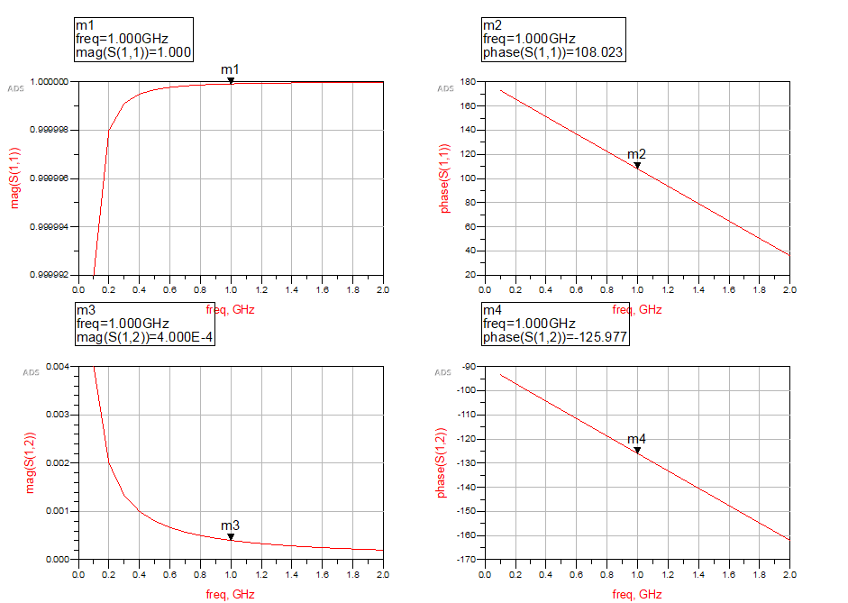
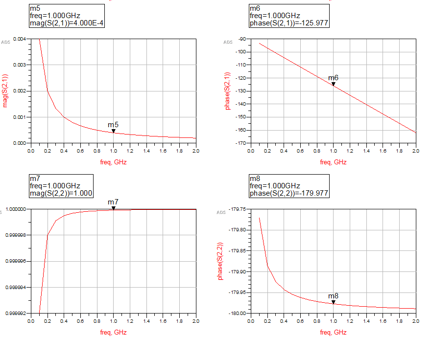
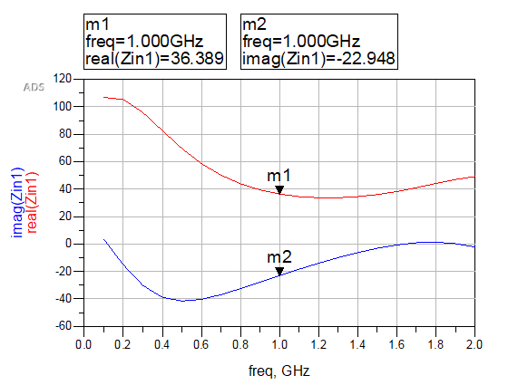
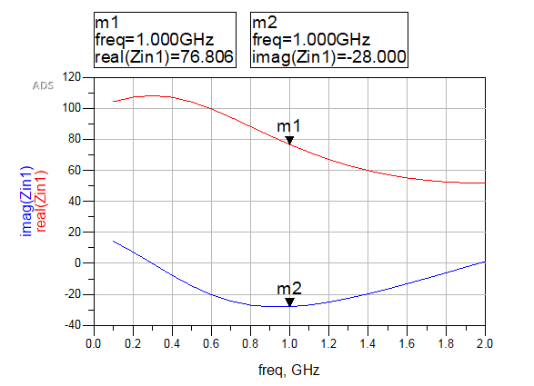
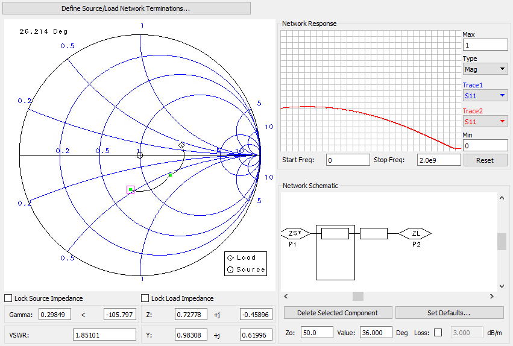
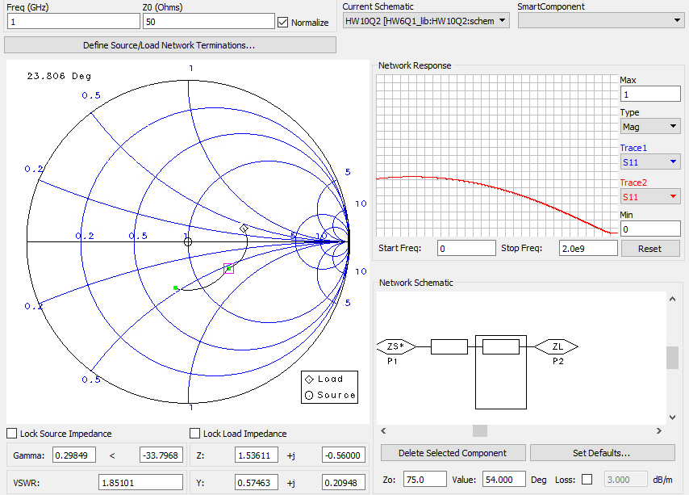
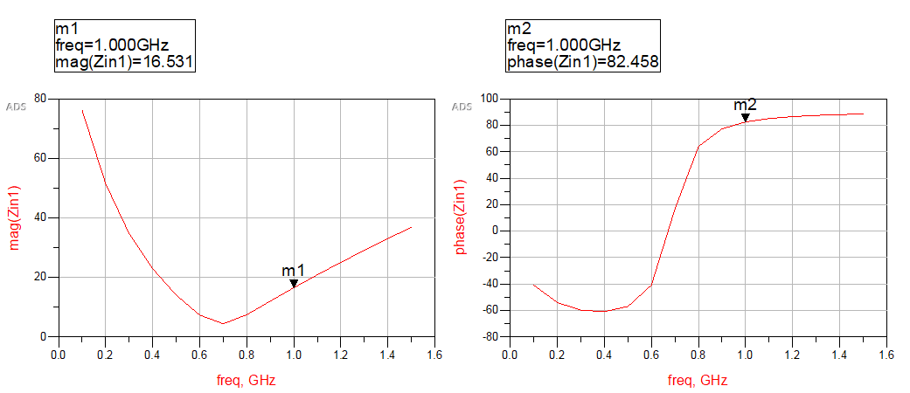
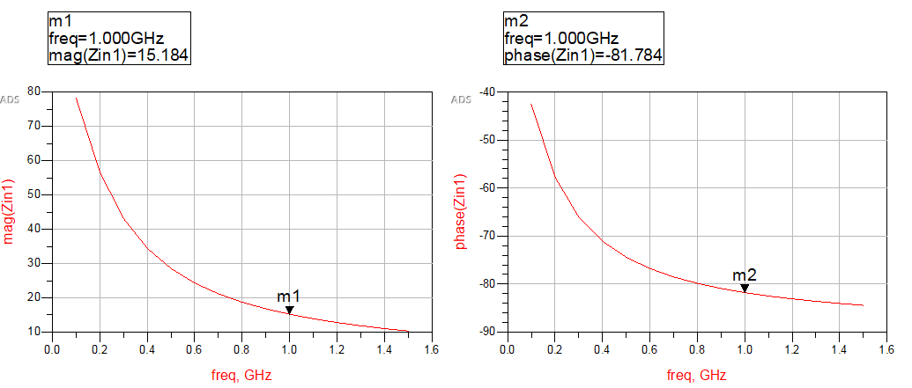
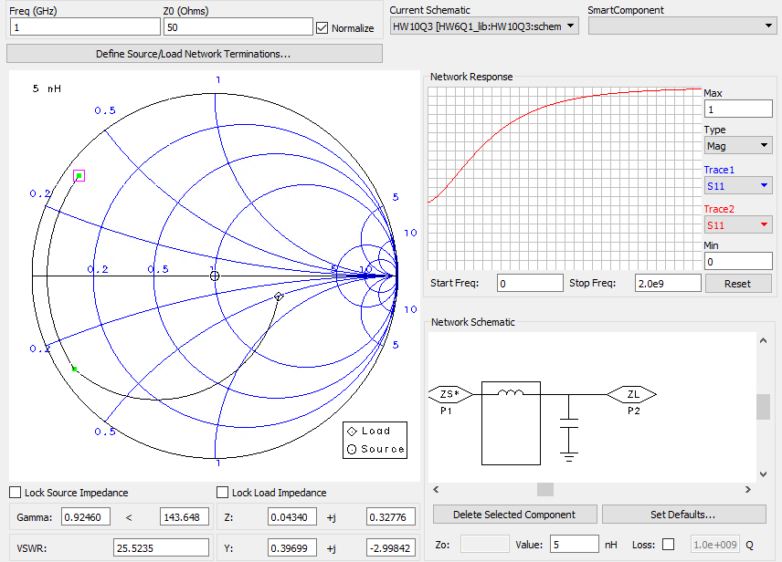
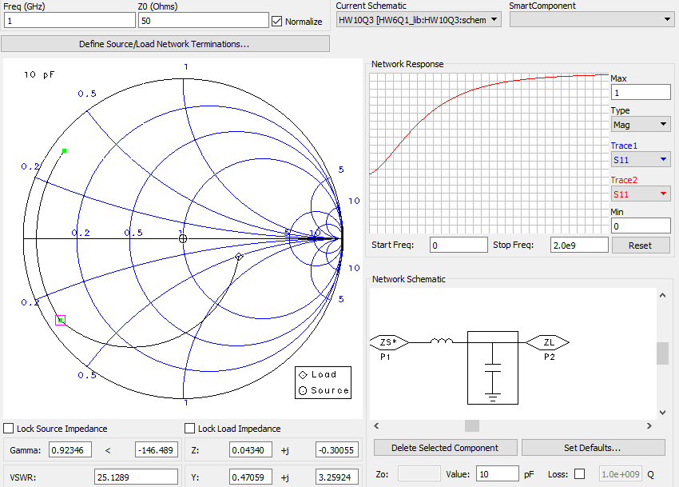

## 電磁波與天線導論HW10

> >Name : 郭忠翔
> >
> >ID : R10522845

### 1

#### (a)

$$
\begin{flalign}
&matrix\quad for\quad Y :\begin{bmatrix}
1&0\\Y&1
\end{bmatrix}\\
&assume\quad \beta=1\\
&matrix\quad for\quad transmission\quad line:\begin{bmatrix}
cos\beta l&jZ_0sin\beta l\\
jY_0sin\beta l&cos\beta l
\end{bmatrix}\\
&ABCD\quad matrix :
\begin{bmatrix}
1&0\\Y&1
\end{bmatrix}
\begin{bmatrix}
cos\beta l&jZ_0sin\beta l\\
jY_0sin\beta l&cos\beta l
\end{bmatrix} = 
\begin{bmatrix}
-2938.117&j29.389\\j80.913&0.809
\end{bmatrix}-<ans>
&
\end{flalign}
$$

#### (b)

​		$A = \frac{(1+S_{11})(1-S_{22})+S_{12}S_{21}}{2S_{21}} = -2938.117-j0.00016-<ans>$

​		$B = Z_0\frac{(1+S_{11})(1+S_{22})-S_{12}S_{21}}{2S_{21}}=0.00587+j29.4940-<ans>$

​		$C = \frac{(1-S_{11})(1-S_{22})-S_{12}S_{21}}{2Z_0S_{21}} = 0.000002+j80.9135-<ans>$

​		$D = \frac{(1-S_{11})(1+S_{22})+S_{12}S_{21}}{2S_{21}}=0.8119-j0.00016-<ans>$

### 2

#### (a)

​	$Z_{in}$	

​	$Z_1$

#### (b)

​	$Z_{in} = (0.72778-j0.45896)*50 = 36.3889-j22.948-<ans>$

​	$Z_1=(1.53611-j0.56)*50=76.8055-j28-<ans>$

### 3

#### (a)

$Z_{in}$

$Z_1$

#### (b)

$Z_{in} = 50*(0.04340+j0.32776) = 16.531e^{j82.458^{\circ}}-<ans>$

$Z_1 = 50*(0.0434-j0.30055) = 15.184e^{-j81.784^{\circ}}-<ans>$

