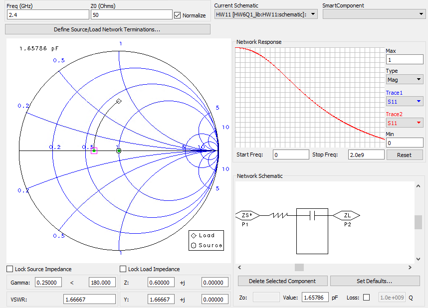
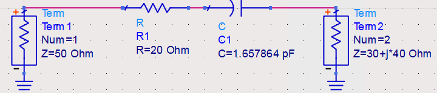
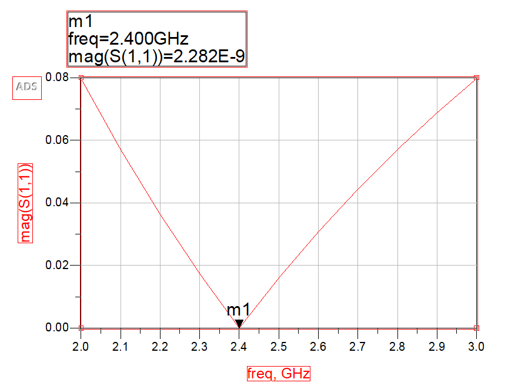
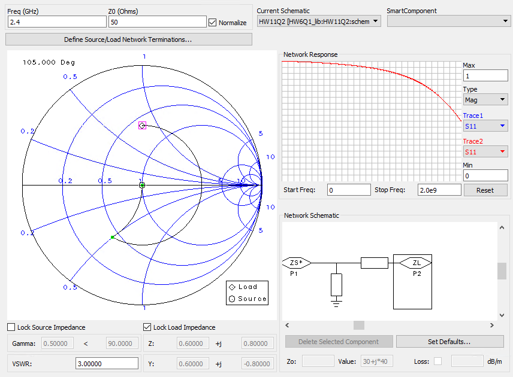
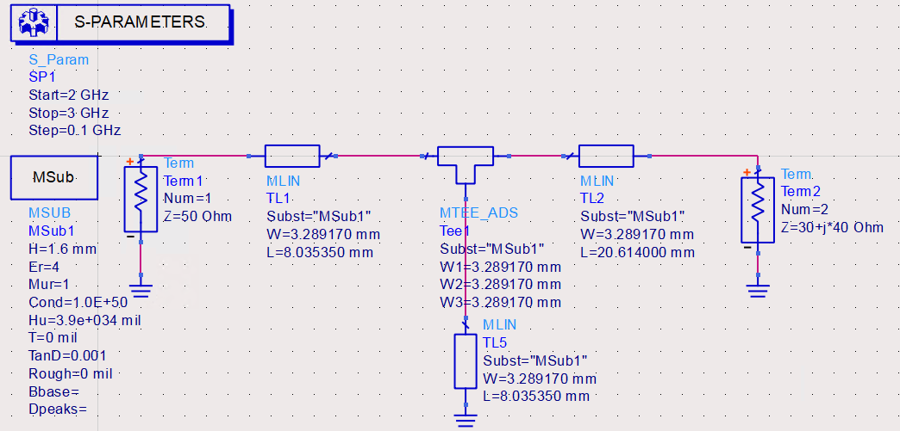
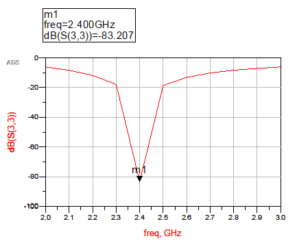

## 電磁波與天線導論 HW11

> >Name : 郭忠翔
> >
> >ID : R10522845

### 1

​		$50-(30+j40) = 20-j40$

​		$impedance\ \ matching\ \ series\ \ R\ \ and\ \ C.$

​		$R = 20,\ \ \frac{1}{jwC} = -j40\Rightarrow C=1.657864(pF)-<ans>$

​		$Simulate\ \ in\ \ Smith\ \ Chart:$

​		$Model\ \ in\ \ ADS:$

### 2

#### (a)

​		$Rebuild\ \ in\ \ transmission\ \ line.$

​								

​		$Covert\ \ to\ \ microstrip\ \ by\ \ line\ \ calculator.$

​		

