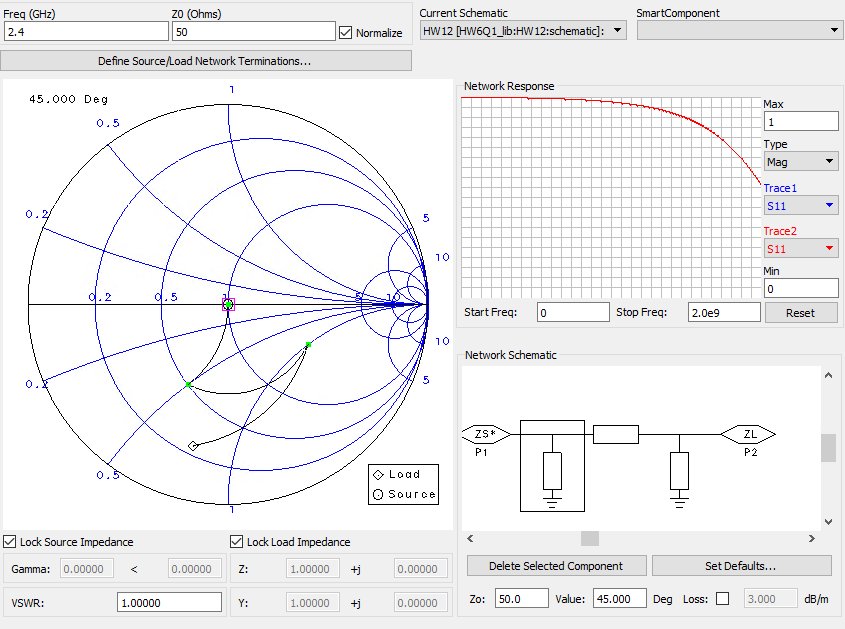
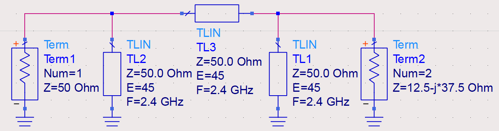
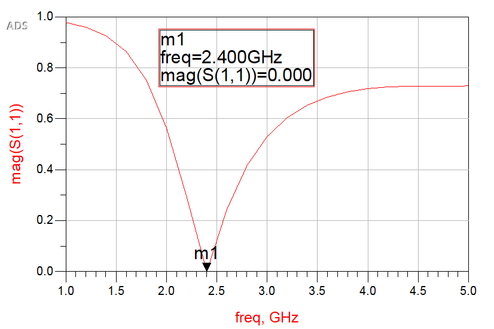
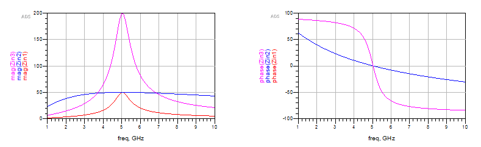

## 電磁波與天線導論 HW12

> >Name : 郭忠翔
> >
> >ID : R10522845

### 1

> Design in Smith chart

> ADS simulation

> reflection coefficient

### 2

>input impedance

>reflection coefficient

$$
\begin{flalign}
&w_0 = \frac{1}{2\pi\sqrt{LC}} = 5.03(GHz)\\
&Q = \frac{R}{\omega_0L} = w_0RC(for\ \ parallel)\\
&Q值正比於R,\ C,\ 反比於L\\
&\therefore Q_a>Q_c>Q_b\\
&Case(c)的R最大，因此Z_{in}會最大,reflection\ coefficient也最大\\
&Case(a)的電容值較大，因此在共振頻率附近會較Case(b)窄\\
&\therefore Case(a)較敏感，只要微調L,C的值就可較大幅改變共振頻率
\end{flalign}
$$
