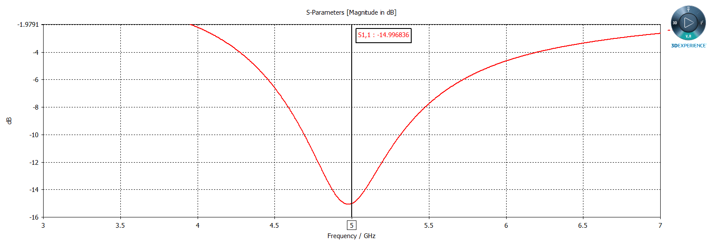
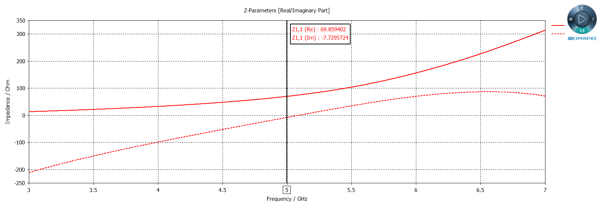
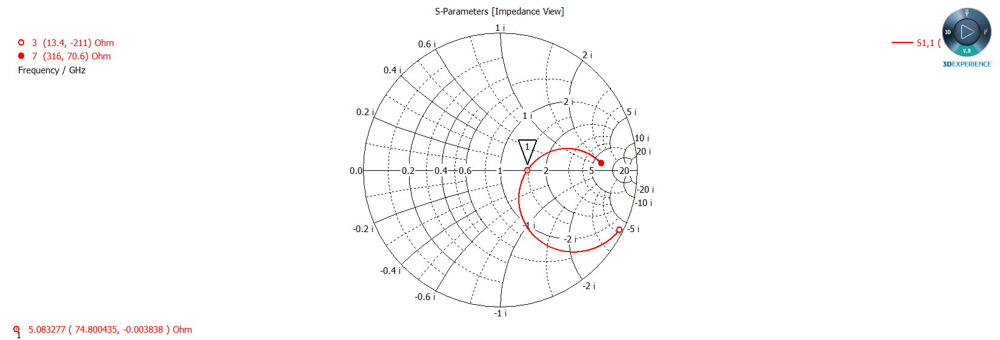
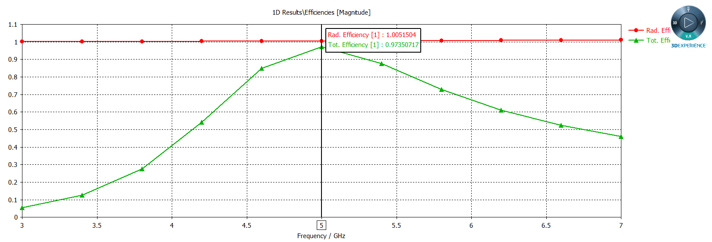
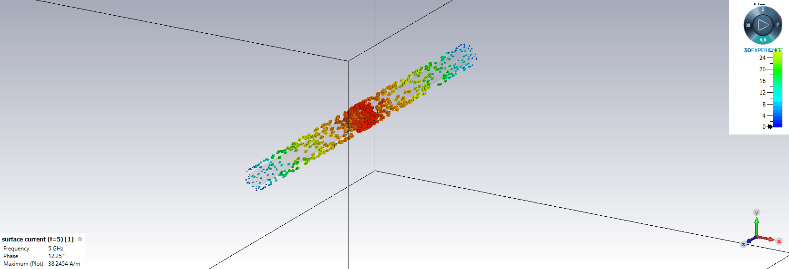
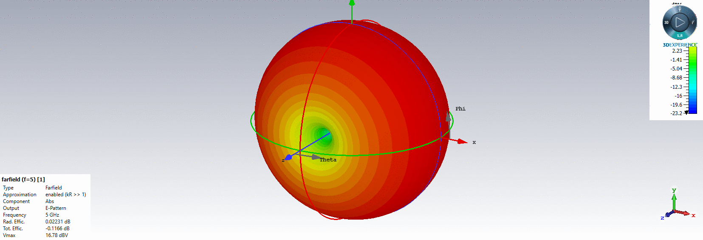

## 電磁波與天線導論HW13

>Name : 郭忠翔
>
>ID : R10522845

### (a) reflection coefficient spectrum and input impedance

>reflection coefficient

>input impedance

### (b) Smith Chart

### (c) broadband radiation efficiency and total efficiency

### (d) surface current

### (e) 3D radiation pattern

### (f) radiation pattern

>E-plane

> H-plane

###  (g) directivity

>E-plane

> H-plane

###  (h) gain

>E-plane

> H-plane

