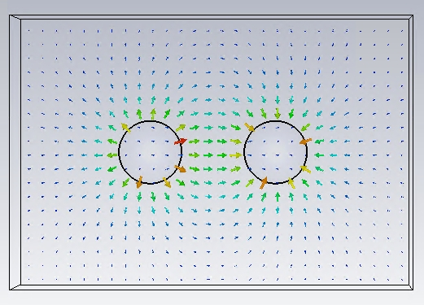
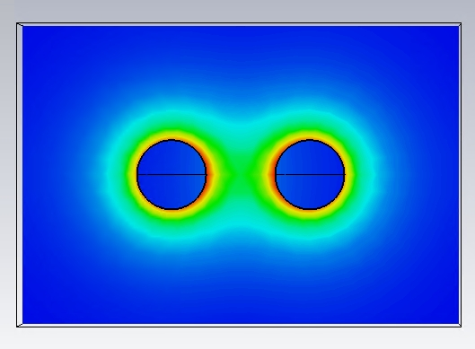
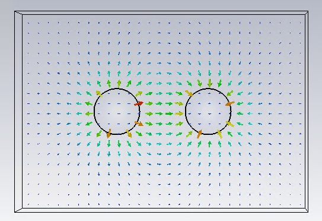
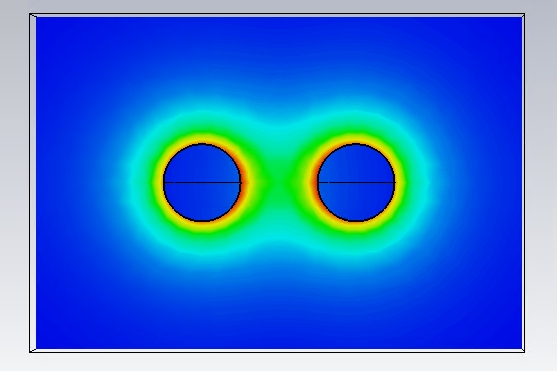

## 電磁波與天線導論 HW3

> >Name : 郭忠翔
> >
> >Student ID : R10522845

### 1

​		$\phi(t) = \frac{3000}{60}2\pi t = 100\pi t$

​		$\Phi(t) = \int_s \vec B\vdot d\vec S = \hat y(0.05)\vdot\hat y(0.02*0.03)*cos\phi(t)=3*10^{-5}cos100\pi t$

​		$V = -N\frac{d\Phi}{dt} = 3\pi *10^{-3}sin(100\pi t)$	

​		$I = \frac{V}{R} = 6\pi *10^{-3}sin(100\pi t)(A)-<ans>$	

### 2

​		$I = -\frac{\epsilon A}{d}V_0\omega sin(\omega t) = -\frac{4\epsilon_0 A}{d}V_0\omega sin(\omega t)$

​		   $=-\frac{4*8.85*10^{-12}*10^{-3}}{1*10^{-2}}30*(2\pi 10^{6})sin(2\pi 10^{-6}t)$

​           $=6.67*10^{-4}(A) -<ans>$

### 3

#### eletrical field

 
 
 

#### electrical flux density

 
 
 

