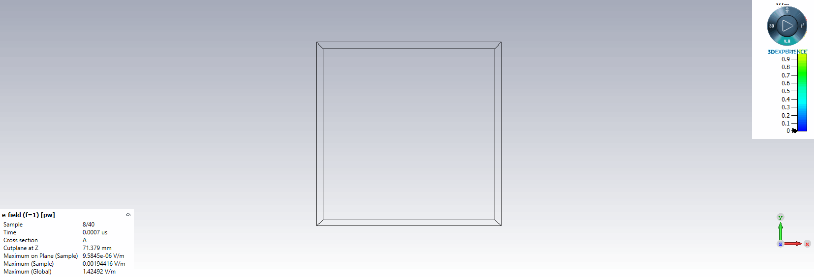
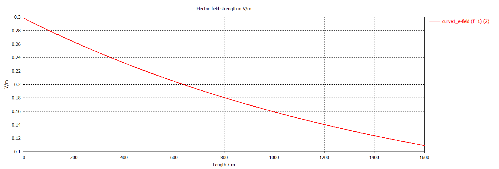

## 電磁波與天線導論 HW4

> >ID : R10522845
> >
> >Name : 郭忠翔

### 1 

#### (a)

​		$f = w/2 \pi = 3*10^9(Hz)$

​		$u_p = \frac{c}{\sqrt{\epsilon _r}} = 1.875*10^8(m/s)$

​		$\lambda = \frac{u_p}{f} = 0.0625(m)$

​		$k = \frac{2 \pi}{\lambda} = 100.53(rad/m)$

​		$\eta = \frac{\mu_0}{\epsilon_r*\epsilon_0} = \frac{4\pi*10^{-7}}{\sqrt{2.56*10^{-9}/36\pi}} = 235.62$

#### (b)

 		$H(z,t) = \hat y \frac{E(z,t)}{\eta} = \hat y 0.021cos(6\pi*10^9t-100.53z)$

### 2

#### (a)

​		$E(z,t) = \hat x\sqrt 2 cos(wt+kz)-\hat y\sqrt 2sin(wt+kz),\quad where$

​		$k = \frac{2\pi}{\lambda} = \frac{2\pi}{0.03} = 209.44(rad/m)$

​		$w = kc = 6.28*10^{9}(rad/s)$

#### (b)

[Q2.gif](./Q2.gif)

### 3

​		$\alpha = \beta = \sqrt{\pi f\mu\sigma} = 6.28*10^{-4}$

​		$u_p = \sqrt{4\pi f \mu \sigma} = 10^7(m/s)$

​		$\lambda = u_p/f = 10^4(m)$

​		$\eta_c = (1+j)\frac{\alpha}{\sigma} = 6.28*(1+j)(\Ome)$

​		$Skin\quad depth\quad \delta_s = \frac{1}{\alpha} = 1591.55$

​		$By\quad the\quad data\quad in\quad Q3.txt,\quad we\quad can\quad compute\quad skin\quad depth = E^{-1}(E(0)/e) = 1591.25$

[Q3.txt](./Q3.txt)

