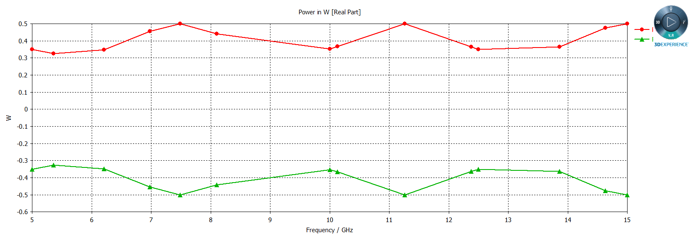
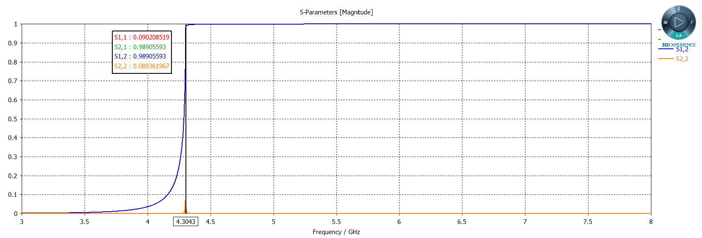
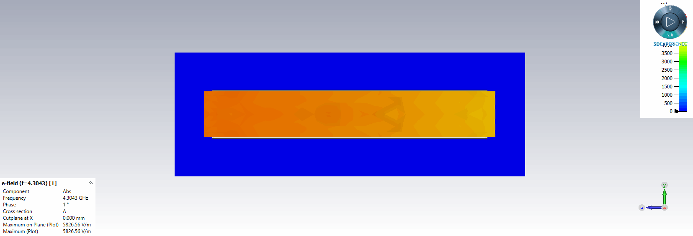
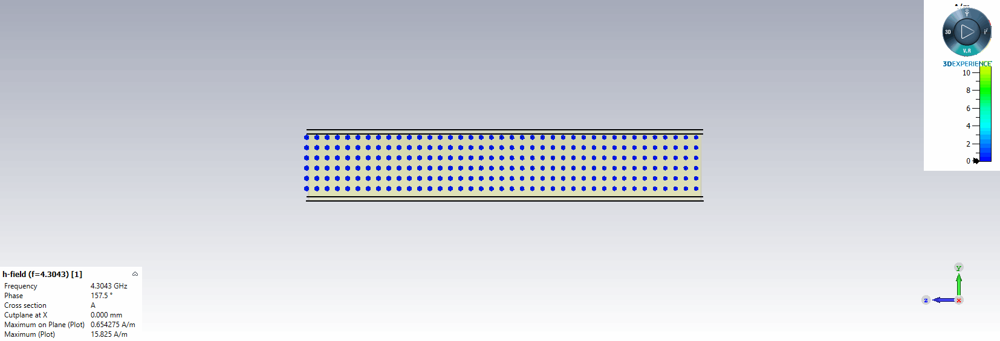

## 電磁波與天線導論HW5

> >Name : 郭忠翔
> >
> >ID : R10522845

### 1

#### (a)

​		$k = \omega \sqrt{\mu_1\epsilon_1} = 20\pi(rad/m)$

​		$k_2 =  w\sqrt{\mu_2\epsilon_2} = \frac{40\pi}{3}$

​		$\eta_1 = \sqrt{\mu_1/\epsilon_1} = 40\pi$

​		$\eta_2 = \sqrt{\mu_2/\epsilon_2} = 60\pi$

​		$\Gamma = (\eta_2-\eta_1)/(\eta_2+\eta_1) = 0.2$

​		$\tau = 1+\Gamma = 1.2$

​		$H^i = \hat z2cos(2\pi*10^9t-20\pi y)$

​		$E^i = -\hat x2cos(2\pi*10^9t-20\pi y)*\eta_1 =-\hat x80\pi cos(2\pi*10^9t-20\pi y) $

​		$E^r = -\hat x\Gamma 80\pi cos(2\pi*10^9t+20\pi y) =-\hat x16\pi cos(2\pi*10^9t+20\pi y) $		

​		$H^r= -\hat z2\Gamma cos(2\pi*10^9t+20\pi y) = -\hat z0.4 cos(2\pi*10^9t+20\pi y)$

​		$E^t = -\hat x80\pi\tau cos(2\pi*10^9t-k_2 y) =-\hat x96\pi cos(2\pi*10^9t-\frac{40\pi}{3} y)$

​		$H^t = \hat z96\pi cos(2\pi*10^9t-\frac{40\pi}{3} y)/\eta_2 =\hat z1.6 cos(2\pi*10^9t-\frac{40\pi}{3}y) $

​		$E_1 = E^i+E^r = -\hat x(80\pi cos(2\pi*10^9t-20\pi y)+16\pi cos(2\pi*10^9t+20\pi y))-<ans>$

​		$H_1 = H^i+H^r = \hat z(2cos(2\pi*10^9t-20\pi y)-0.4 cos(2\pi*10^9t+20\pi y))-<ans>$

​		$E_2 = E^t = -\hat x96\pi cos(2\pi*10^9t-\frac{40\pi}{3} y)-<ans>$		

​		$H_2 = H^t = \hat z1.6 cos(2\pi*10^9t-\frac{40\pi}{3}y)-<ans>$

#### (b)

​		$S^i_{av} = \hat y\frac{\abs{E_0}^2}{2\eta_1}=\hat y\frac{(80\pi)^2}{2*40\pi} = \hat y80\pi(W/m^2)$

​		$S^r_{av} = -\hat y\frac{\abs{E^i_0}}{2\eta_1} = -\hat y3.2\pi$

​		$S^t_{av} = S^i_{av}+S^r_{av} = \hat y76.8\pi$

### 2

#### (a)

​		$\eta_1 = \eta_3 = \sqrt{\mu_0/\epsilon_0}$

​		$\eta_2 = \sqrt{\mu_0/4\epsilon_0}$

​		$\Gamma_{12} = (\eta_2-\eta_1)/(\eta_2+\eta_1) = -\frac{1}{3}-<ans>$

​		$\Gamma_{23} = (\eta_3-\eta_2)/(\eta_2+\eta_3) = \frac{1}{3}$

​		$\tau_{23} = 1+\Gamma_{23} = \frac{4}{3}-<ans>$

#### (b)

> >reflection and transmission coefficients

> >power reflection and transmission 

### 3

​		$f = \frac{c}{2}\sqrt{(\frac{m}{a})^2+(\frac{n}{b})^2} = \frac{c}{2}\sqrt{(\frac{1}{34.8488*10^{-3}})^2+(\frac{0}{15.7988*10^{-3}})^2} = 4.3043(GHz)$

> > reflection and transmission coefficients

> > electric field

> > magnetic field

