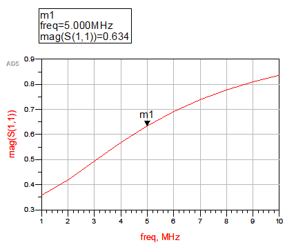
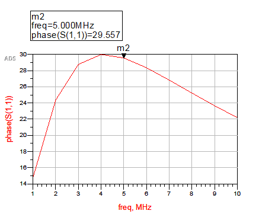
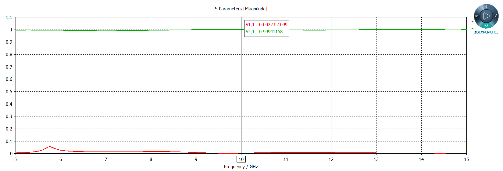
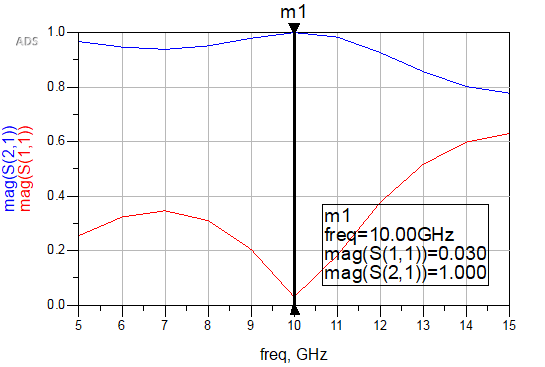

## 電磁波與天線導論HW6

> >Name : 郭忠翔
> >
> >ID : R10522845

### 1

#### (a)

​		$Z_L = R+jwL = 600+j2\pi (5*10^{6})(0.02*10^{-3}) = 600+j200\pi$

​		$\Gamma = \frac{Z_L-Z_0}{Z_L+Z_0} = \frac{300+j200\pi}{900+j200\pi} = 0.634e^{j0.5159}-<ans>$

#### (b)

magnitude

phase

### 2 

#### (a)

​		$s = \frac{0.001}{0.01} = 0.1$

​		$x = 0.56(\frac{\epsilon_r-0.9}{\epsilon_r+3})^{0.05} = 0.56(\frac{2.5-0.9}{2.5+3})^{0.05} = 0.5265$

​		$y = [1+0.02ln(\frac{s^4+3.7*10^{-4}s^2}{s^4+0.43})+0.05ln(1+1.7*10^{-4}s^3)]|_{s =0.1 } = 0.8334$

​		$\epsilon_{eff} = \frac{\epsilon_r+1}{2}+(\frac{\epsilon_r-1}{2})(1+\frac{10}{s})^{-xy} = 1.849-<ans>$

​		$t = (\frac{30.67}{s})^{0.75} = 73.2884$

​		$Z_0 = \frac{60}{\sqrt{\epsilon_{eff}}}ln(\frac{6+(2\pi-6)e^{-t}}{s}+\sqrt{1+\frac{4}{s^2}}) = 193.3698(\Omega)-<ans>$

​		$\beta = \frac{\omega}{c}\sqrt{\epsilon_{eff}} = \frac{2\pi10^{10}}{3*10^8}\sqrt{1.849} = 284.7915(rad/m)-<ans>$

#### (b)

##### CST

###### ADS

