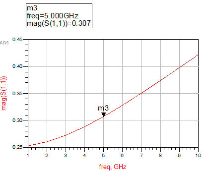
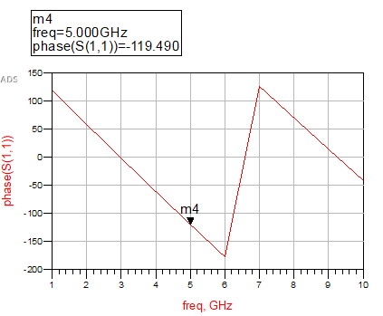
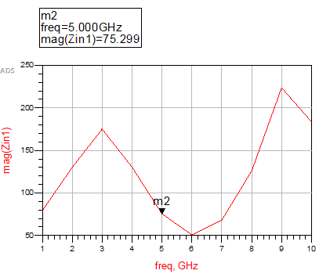
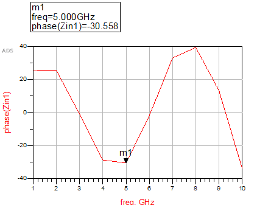
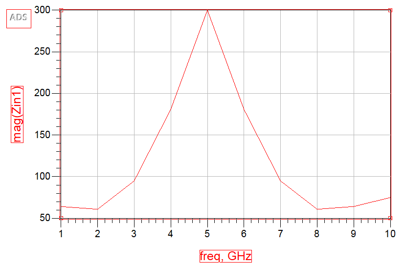
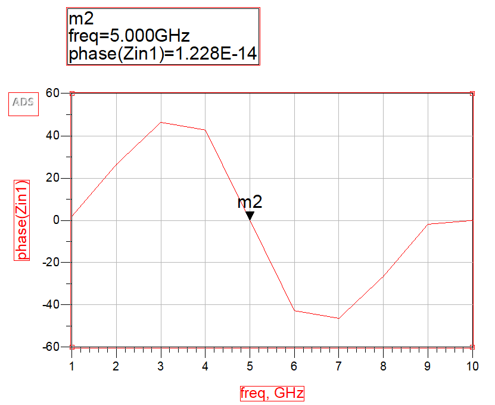

## 電磁波與天線導論 HW7

> >Name : 郭忠翔
> >
> >ID : R10522845

### 1

​		$\beta l = \frac{2\pi}{\lambda}0.35\lambda = 0.7\pi$

​		$Z_0 = 100$

​		$Z_L = 60+j30$

​		$\Gamma = \frac{Z_L-Z_0}{Z_L+Z_0} = 0.3071e^{j132.5049^\circ}-<ans>$

​		$Z_{in} = Z_0(\frac{Z_L+jZ_0tan\beta l}{Z_0+jZ_Ltan \beta l})= 75.299e^{-j30.558^{\circ}} -<ans>$

reflection magnitude

reflection phase		

input impedance magnitude

input impedance phase

### 2

​		$\beta l = \frac{2\pi}{\lambda}0.25\lambda = 0.5\pi$				

​		$Z_{in} = Z_0(\frac{Z_L+jZ_0tan\beta l}{Z_0+jZ_Ltan \beta l})= \frac{Z_0^2}{Z_L}$

​		$Z_{in}|_{z_0 = 50} = \frac{50^2}{75} = 100/3$

​		$Z_{in}|_{z_0 = 100} = \frac{100^2}{100/3} = 300(\Omega)-<ans>$

