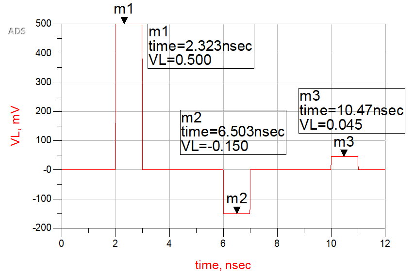
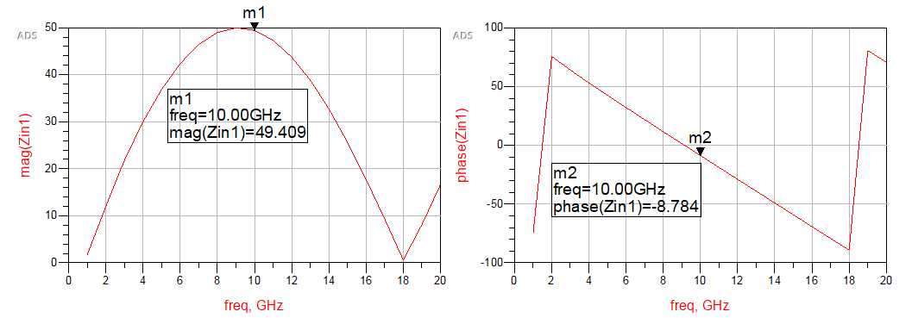
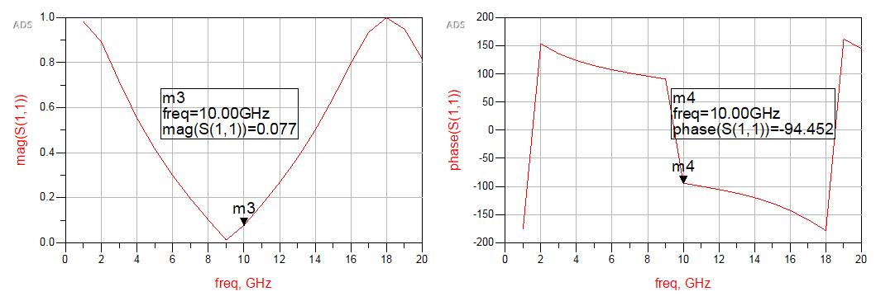

## 電磁波與天線導論HW8

> >Name : 郭忠翔
> >
> >ID : R10522845

### 1

​		$T = \frac{l}{c} = 2(ns)$

​		$\Gamma_L = \frac{R_L-Z_0}{R_L+Z_0} = -0.6$

​		$\Gamma_g = \frac{R_g-Z_0}{R_g+Z_0} = 0.5$

​		$V_1^+ = \frac{V_{in}*Z_0}{R_g+Z_0} = 1.25(V)$

​		$V_L(t =2-3(ns)) = 1.25-1.25*0.6 = 0.5$

​		$V_L(t =5-6(ns)) = -0.75*0.5+0.75*0.5*0.6 = -0.15$

​		$V_L(t =10-11(ns)) = 0.225*0.5-0.225*0.5*0.6 = 0.045$		

### 2

### (a)

​		$Z_L = \frac{1}{\frac{1}{100+250}+jwc} = 0.0045-j1.061$

​		$\beta l=\frac{5\pi}{9}$

​		$Z_{in}' = Z_0\frac{Z_L+jZ_0tan\beta l}{Z_0+jZ_Ltan\beta l} = 0.193-j323.56$

​		$Z_{in} = \frac{1}{\frac{1}{Z_{in}'}+\frac{1}{50}} = 48.8296-j7.5449-<ans>$ 

​		$\Gamma_{in} = \frac{Z_{in}-Z_0}{Z_{in}+Z_0} = -0.006-j0.0768-<ans>$

#### (b)

>$Z_{in}$

>$\Gamma$

