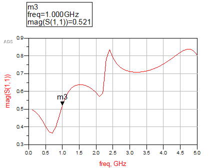

## 電磁波與天線導論 HW9

> >Name : 郭忠翔
> >
> >ID : R10522845

### Q1

#### (a)

$$
\begin{flalign}
&Y_1 = \frac{1}{jwL_1+\frac{1}{jwC_3}} \\
&Y_2 = jwC_1\\
&Y^1 = Y_1+Y_2\\
&Z_{in}^1 = Z_0\frac{\frac{1}{Y^1}+jZ_0tan(36^\circ)}{Z_0+j\frac{1}{Y^1}tan(36^\circ)}\\
&Y^2 = \frac{1}{R_3}+\frac{1}{Z_{in}^1}\\
&Z_{in}^2 = Z_0\frac{\frac{1}{Y^2}+jZ_0tan(25^\circ)}{Z_0+j\frac{1}{Y^2}tan(25^\circ)}\\
&Z_{in} = R_4+Z_{in}^2 = 108.99 + j68.228 (\Omega)-<ans>\\
&\Gamma = \frac{Z_{in}-Z_0}{Z_{in}+Z_0} = 0.4688 + j0.2279-<ans>
&
\end{flalign}
$$

#### (b)

>input impedance

>reflection

$$
\begin{flalign}
&T\quad network:\\
&\begin{bmatrix}
V_1\\V_2
\end{bmatrix} = 
\begin{bmatrix}
Z_{11}&Z_{12}\\Z_{21}&Z_{22}
\end{bmatrix} 
\begin{bmatrix}
I_1\\I_2
\end{bmatrix}\\
&Z_{11} = \frac{V_1}{I_1}|_{I_2 = 0} = \frac{1}{Y_A}+\frac{1}{Y_B}\\
&Z_{12} = \frac{V_1}{I_2}|_{I_1 = 0} = \frac{V_2}{I_2}\frac{\frac{1}{Y_B}}{\frac{1}{Y_A}+\frac{1}{Y_B}} = \frac{1}{Y_B}\\
&Z_{21} = Z_{12}\\
&Z_{22} = \frac{V_2}{I_2}|_{I_1 = 0} = \frac{1}{Y_A}+\frac{1}{Y_B}\\
&Z\quad matrix:
\begin{bmatrix}
\frac{Y_A+Y_B}{Y_AY_B}&\frac{1}{Y_B}\\
\frac{1}{Y_B}&\frac{Y_A+Y_B}{Y_AY_B}
\end{bmatrix}-<ans>\\
&\begin{bmatrix}
I_1\\I_2
\end{bmatrix} = 
\begin{bmatrix}
Y_{11}&Y_{12}\\Y_{21}&Y_{22}
\end{bmatrix} 
\begin{bmatrix}
V_1\\V_2
\end{bmatrix}\\
&Y\quad matrix: Z^{-1} = 
\begin{bmatrix}
\frac{Y_A(Y_A+Y_B)}{Y_AY_B}&-\frac{Y_A^2}{2Y_A+Y_B}\\
-\frac{Y_A^2}{2Y_A+Y_B}&\frac{Y_A(Y_A+Y_B)}{Y_AY_B}
\end{bmatrix}-<ans>\\
&\pi\quad network:\\
&Z_A = \frac{\frac{1}{Y_A^2}+\frac{2}{Y_AY_B}}{\frac{1}{Y_B}} = \frac{2Y_A+Y_B}{Y_A^2}\\
&Z_B = \frac{\frac{1}{Y_A^2}+\frac{2}{Y_AY_B}}{\frac{1}{Y_A}} = \frac{2Y_A+Y_B}{Y_AY_B}\\
&\begin{bmatrix}
I_1\\I_2
\end{bmatrix} = 
\begin{bmatrix}
Y_{11}&Y_{12}\\Y_{21}&Y_{22}
\end{bmatrix} 
\begin{bmatrix}
V_1\\V_2
\end{bmatrix}\\
&Y_{11} = Y_{22} = \frac{1}{Z_A} + \frac{1}{Z_B} = \frac{Y_A(Y_A+Y_B)}{2Y_A+Y_B}\\
&Y_{12} = Y_{21} = \frac{1}{Z_A} = \frac{Y_A^2}{2Y_A+Y_B}\\
&Y\quad matrix : 
\begin{bmatrix}
\frac{Y_A(Y_A+Y_B)}{2Y_A+Y_B}&\frac{Y_A^2}{2Y_A+Y_B}\\
\frac{Y_A^2}{2Y_A+Y_B}&\frac{Y_A(Y_A+Y_B)}{2Y_A+Y_B}
\end{bmatrix}-<ans>\\
&Z\quad matrix:
\begin{bmatrix}
\frac{Y_A+Y_B}{Y_AY_B}&-\frac{1}{YB}\\
-\frac{1}{YB}&\frac{Y_A+Y_B}{Y_AY_B}
\end{bmatrix}-<ans>
&
\end{flalign}
$$

### Q3

$$
\begin{flalign}
&Z_{in} = \frac{1}{\frac{1}{z}+\frac{1}{z_0}} = \frac{z_0z}{z+z_0}\\
&S_{11} = S_{22} = \frac{Z_{in}-z_0}{Z_{in}+z_0} = \frac{-z_0}{2z+z_0}-<ans>\\
&S_{12} = S_{21} = 1-<ans>
&
\end{flalign}
$$

